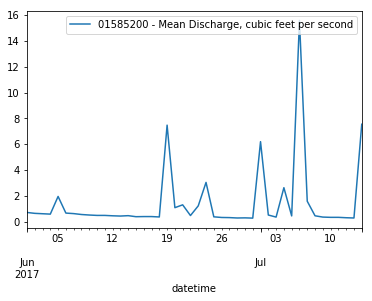
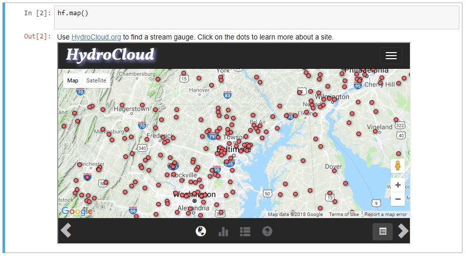

===============================
HydroFunctions
===============================

.. image:: https://img.shields.io/pypi/v/hydrofunctions.svg
        :target: https://pypi.python.org/pypi/hydrofunctions
        :alt: Visit Hydrofunctions on PyPI

.. image:: https://img.shields.io/travis/mroberge/hydrofunctions.svg
        :target: https://travis-ci.org/mroberge/hydrofunctions
        :alt: Unit Testing Status

.. image:: https://codecov.io/gh/mroberge/hydrofunctions/branch/master/graph/badge.svg
        :target: https://codecov.io/gh/mroberge/hydrofunctions
        :alt: Code Coverage Status

.. image:: https://readthedocs.org/projects/hydrofunctions/badge/?version=latest
        :target: https://hydrofunctions.readthedocs.io/en/latest/?badge=latest
        :alt: Documentation Status

.. image:: https://img.shields.io/github/license/mashape/apistatus.svg
        :target: https://github.com/mroberge/hydrofunctions/blob/master/LICENSE
        :alt: MIT license

A suite of convenience functions for exploring water data in Python.

Features
--------

* Retrieves stream data from the USGS NWIS service
* Select data using multiple site numbers, by state, county codes, or a boundary box
* Preserves NWIS metadata, including NoData values
* Helpful error messages to help you write valid requests
* Extracts data into a Pandas dataframe, json, or dict
* Plot beautiful graphs in Jupyter Notebooks
   * hydrographs (or time series of any data)
   * flow duration charts
   * cycle plots to illustrate annual or diurnal cycles
   * Interactive map for finding stream gauge ID numbers
* Plotting and manipulation through Pandas dataframes
* Retrieve USGS rating curves, peak discharges, field notes, and site files for gauging stations
* Retrieve USGS daily, monthly, and annual statistics for gauging stations
* Saves data in compact, easy-to-use parquet files instead of requesting the same dataset repeatedly
* **Massive** `Users Guide`_ **that makes Hydrology AND Data Science easy!**

⇨ Still in active development! Let me know what features you want!

Read the `Users Guide`_ for more details.

Basic Usage
-----------

First, import hydrofunctions into your project. If you plan to work with Jupyter
notebooks, then go ahead and enable automatic chart display:

.. code-block:: ipython

    In  [1]: import hydrofunctions as hf
             %matplotlib inline

Create an NWIS data object to hold our request and the data we will retrieve.
We will request the instantaneous values ('iv') for site '01585200' for the
past 55 days:

.. code-block:: ipython

    In  [2]: herring = hf.NWIS('01585200', 'iv', period='P55D')
    Requested data from https://waterservices.usgs.gov/nwis/iv/?format=json%2C1.1&sites=01585200&period=P55D

Check that the request went smoothly:

.. code-block:: ipython

    In  [3]: herring.ok
    Out [3]: True

Find out what data we received:

.. code-block:: ipython

    In  [4]: herring
    Out [4]: USGS:01585200: WEST BRANCH HERRING RUN AT IDLEWYLDE, MD
                 00060: <5 * Minutes>  Discharge, cubic feet per second
                 00065: <5 * Minutes>  Gage height, feet
             Start: 2019-05-25 01:05:00+00:00
             End:   2019-07-19 19:05:00+00:00

This tells us the name of our site, and gives a list of the parameters that we
have. For each parameter it lists how frequently the data were collected, and
it show the common name of the parameter and its units.

Create a dataframe using only our discharge data, and list the first five items:

.. code-block:: ipython

    In  [5]: herring.df('discharge').head()
    Out [5]:

*--a table with our data appears--*

    +------------------------------+---------------------------+
    |          datetimeUTC         | USGS:01585200:00060:00000 |
    +------------------------------+---------------------------+
    |   2019-05-25 01:05:00+00:00  |                1.57       |
    +------------------------------+---------------------------+
    |   2019-05-25 01:10:00+00:00  |                1.57       |
    +------------------------------+---------------------------+
    |   2019-05-25 01:15:00+00:00  |                1.51       |
    +------------------------------+---------------------------+
    |   2019-05-25 01:20:00+00:00  |                1.57       |
    +------------------------------+---------------------------+
    |   2019-05-25 01:25:00+00:00  |                1.57       |
    +------------------------------+---------------------------+

Plot the data using built-in methods from Pandas and mathplotlib:

.. code-block:: ipython

    In  [6]: herring.df('q').plot()
    Out [6]:

*--a stream hydrograph appears--*

Draw an interactive map in a Jupyter Notebook:

.. code-block:: ipython

    In  [7]: hf.draw_map()
    Out [7]:

Learn more:

* `More usage <https://hydrofunctions.readthedocs.io/en/latest>`_ tips
* `Introduction to Hydrofunctions <https://github.com/mroberge/hydrofunctions/blob/master/notebooks/Introduction%20to%20Hydrofunctions.ipynb>`_, a Jupyter Notebook with a quick tutorial.

Easy Installation
-----------------

The easiest way to install Hydrofunctions is by typing this from your
command line:

.. code-block:: console

    $ pip install hydrofunctions

Hydrofunctions depends upon Pandas and numerous other scientific packages
for Python. `Anaconda <https://www.continuum.io/open-source-core-modern-software>`_
is an easy, safe, open-source method for downloading everything and avoiding
conflicts with other versions of Python that might be running on your
computer.

Visit the `Installation Page <https://hydrofunctions.readthedocs.io/en/master/installation.html>`_
in the Users Guide to learn how to install
Anaconda, or if you have problems using the Easy Installation method above.

Other Projects You Should See
-----------------------------

`Hydropy <https://github.com/stijnvanhoey/hydropy>`_, a Python package that builds upon Pandas for enhanced data selection and plotting of hydrology data.

`WellApplication <https://github.com/inkenbrandt/WellApplication>`_ a Python package that provides functions for working with dataloggers and USGS well data.

This package was created with Cookiecutter_ and the `audreyr/cookiecutter-pypackage`_ project template.

.. _Cookiecutter: https://github.com/audreyr/cookiecutter
.. _`audreyr/cookiecutter-pypackage`: https://github.com/audreyr/cookiecutter-pypackage

MIT License

Copyright (c) 2016, Martin Roberge and contributors

.. _`Users Guide`:  https://hydrofunctions.readthedocs.io/en/latest