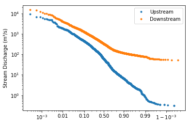
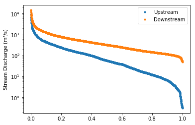
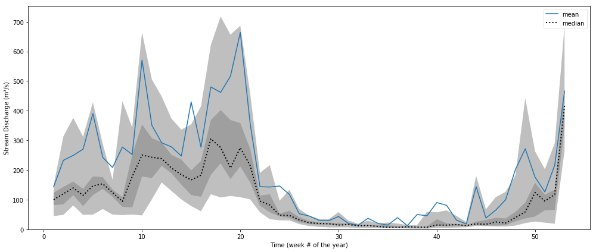
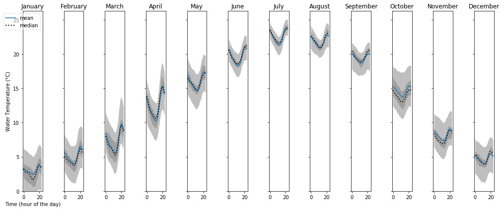

========
Graphing
========

Hydrofunctions provides several ways to plot your data in a Jupyter notebook.
Many of these methods use the graphing methods built-in to the Pandas
dataframe. Some of these methods are specific to Hydrofunctions. All of these
techniques use `matplotlib`_ under the hood to create the charts, so
Hydrofunctions includes it during installation.

.. _matplotlib: https://matplotlib.org/

Getting Ready
=============

First Step: Automatic Display of Charts in Jupyter
--------------------------------------------------

The first step for creating a graph is to import Hydrofunctions, and then
provide Jupyter with a directive to automatically display all charts from
matplotlib::

    >>> import hydrofunctions as hf
    >>> `%matplotlib inline`

Second Step: Preparing our data for plotting
--------------------------------------------

The next step is to request some data from the NWIS for us to plot::

    >>> request = hf.NWIS('01585200', 'dv', period='P999D')

Next, we create a dataframe called 'data' from our request::

    >>> data = request.df('q')

The rest of the examples will assume that we have a dataframe called data.

Flow Duration Chart
===================

Flow duration charts are cumulative frequency charts that are used in hydrology
to compare stream flow at different stream gauges. They are constructed with
daily mean discharge data, and are typically used to analyze the typical
baseflow and low flow conditions.  They are similar to a flood frequency
analysis, in that they both try to illustrate the relationship between the
magnitude of the flows and the frequency that these flows occur. Large
discharges occur infrequently, while it is common to see a baseflow discharge
or higher.

Hydrofunctions includes a Flow Duration Chart, which you access as a function::

    >>> hf.flow_duration(data)

Options include the ability to change the following:

- xscale: default is 'logit'; may also be 'linear'
- yscale: default is 'log'; may also be 'linear'
- ylabel: default is 'Discharge'; may be any string.
- symbol: default is '.' for small points. May also be:
    - pixel point: ','
    - up triangle: '^'
    - circle: 'o'
    - plus: '+'

Example of a flow duration chart using all of the defaults ('log' y axis and
'logit' x axis).

This chart compares the discharge at two locations: a smaller upstream site on
the Shenandoah River, and a larger downstream site with higher discharges. The
y axis uses the default logarithmic scale, because river discharges frequently
range over several orders of magnitude. The x axis plots the
probability that a discharge of this size or larger will occur on any given
day. Note that the graph slopes from the upper left to the lower right in an
inverse relationship. This means that the river has a low probability of
exceeding the high flows, and a high probability of exceeding the low flows.
The line for the larger stream is always above the line for the smaller stream
because the larger stream has higher discharges.

The first graph used a 'logit' scale on the x axis, while this second graph
uses a 'linear' x axis to plot the same data.  The logit scale will render a
normal "bell curve" distribution as almost a straight line in a cumulative
graph. In the second chart, the linear x axis uses the same distance between
80 and 90% as between 40 and 50%.  In both graphs, the median value is plotted
in the center of the x axis, at the 50% mark, since it has a 50% chance of
happening on any given day.

Cycle Plot
==========

The cycle plot was inspired by an example created by Jake VanderPlas in his
2016 book, `Python data science handbook: essential tools for working with
data. <https://jakevdp.github.io/PythonDataScienceHandbook/03.11-working-with-time-series.html>`_

This graph is designed for discovering cyclical components within a series. For
example, there is a 'diurnal' cycle in the amount of sunlight that you get over
the course of a day.  Because the amount of sunlight also changes with the
seasons, you can also see an 'annual' cycle in sunlight and in temperatures
over the course of a year.

.. code-block:: ipython

    In  [7]: hf.cycleplot(data, 'annual-week')
    Out [7]:

In this graph, several years of data for a site along the Shenandoah River were
grouped into 52 different bins, each corresponding to a different week of the
year. Then the mean and median values in each bin were connected with lines.
A light gray band was drawn around the 0.2 to 0.8 quantile range and a dark
gray band was drawn around the 0.4 to 0.6 quantile range.

In this graph, we are showing how the water temperature varies over the course
of a day during each of the twelve months of the year. Temperatures are warmest
in July and coldest in January. However, over the course of a day, the lowest
temperature occurs at hour 12 and the warmest temperature around hour 20. Since
these temperatures are in UTC, and this site is in the Eastern Time Zone
(UTC-5), these times correspond to 7 am and 3 pm (20 -5 = 15:00 hours, or 3pm).

Pandas plotting
===============

The Pandas dataframe has several different graphing methods built-in.  Access
these methods using dot notation, like this:

Plotting a hydrograph:

.. code-block:: ipython

    In  [1]: data.plot()

Plotting a Histogram:

.. code-block:: ipython

    In  [1]: data.hist()
    In  [1]: data.plot.hist()

Box Plot:

.. code-block:: ipython

    In  [1]: data.plot.box()

Kernel Density Plot:

.. code-block:: ipython

    In  [1]: data.plot.kde()
