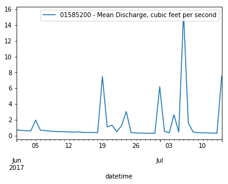

====================
Using Hydrofunctions
====================

First, import hydrofunctions into your project::

    >>> import hydrofunctions as hf

Jupyter notebooks are a great tool for using hydrofunctions, because you can
plot your data and edit your work interactively. To enable chart plotting in
Jupyter, type::

    >>> %matplotlib inline

Next, request ten days of data from the USGS National Water Information
System (NWIS)::

    >>> site = '01570500'
    >>> harrisburg = hf.NWIS(site, 'iv', period='P10D')
    Requested data from https://waterservices.usgs.gov/nwis/iv/?format=json%2C1.1&sites=01570500&period=P10D

Use the 'ok' attribute to check that the transfer went okay:

    >>> harrisburg.ok
    True

Find out about what we collected::

    >>> harrisburg
    USGS:01570500: Susquehanna River at Harrisburg, PA
        00045: <30 * Minutes> Precipitation, total, inches
        00060: <30 * Minutes> Discharge, cubic feet per second
        00065: <30 * Minutes> Gage height, feet
    Start: 2019-04-06 00:30:00+00:00
    End:   2019-04-15 23:00:00+00:00

This listing reports the site ID and name for the site we requested, followed
by a list of all of the parameters collected at this site. For each parameter,
it lists the parameter code, how frequently the data are collected for this
parameter, and the name of the parameter written out with units. The start and
end times of the dataset are given in Universal Time (UTC).

You can output the data as a JSON dict using the `.json` attribute, or as a
Pandas dataframe by using the .df() method.  The .df() method takes parameters
to limit what data will go into the dataframe.

View the first five rows of a dataframe that only contains the discharge data::

    >>> harrisburg.df('discharge').head()

Our data appears in a table...

    +---------------------------+---------------------------+
    | datetimeUTC               | USGS:01570500:00060:00000 |
    +---------------------------+---------------------------+
    | 2019-04-06 00:30:00+00:00 |                   44200.0 |
    +---------------------------+---------------------------+
    | 2019-04-06 01:00:00+00:00 |                   44000.0 |
    +---------------------------+---------------------------+
    | 2019-04-06 01:30:00+00:00 |                   44000.0 |
    +---------------------------+---------------------------+
    | 2019-04-06 02:00:00+00:00 |                   43700.0 |
    +---------------------------+---------------------------+
    | 2019-04-06 02:30:00+00:00 |                   43700.0 |
    +---------------------------+---------------------------+

Because the .df() method returns a dataframe, you have access to all of the
methods associated with Pandas, including .plot(), .describe(), and .info() !

Plot the data using Pandas and mathplotlib::

    >>> herring.df().plot()

As long as you had `%matplotlib inline` enabled earlier, you will get a graph.

To learn more about hydrofunctions, try using

    >>> help(hf)

and

    >>> dir(response)

to list all of the methods available.

Example Notebooks
-----------------

- `Introduction to Hydrofunctions <https://github.com/mroberge/hydrofunctions/blob/master/notebooks/Introduction%20to%20Hydrofunctions.ipynb>`_
- `Selecting Sites <https://github.com/mroberge/hydrofunctions/blob/master/notebooks/Selecting_Sites.ipynb>`_
- `Writing Valid Requests for NWIS <https://github.com/mroberge/hydrofunctions/blob/master/notebooks/Writing_Valid_Requests_for_NWIS.ipynb>`_
- `Draw Map Demo <https://github.com/mroberge/hydrofunctions/blob/master/notebooks/Draw_Map_Demo.ipynb>`_
- `Comparing Urban and Rural Streams <https://github.com/mroberge/hydrofunctions/blob/master/notebooks/Comparing_Urban_and_Rural_Streams.ipynb>`_
- `NWIS Trial Run <https://github.com/mroberge/hydrofunctions/blob/master/notebooks/NWIS%20trial%20run.ipynb>`_
